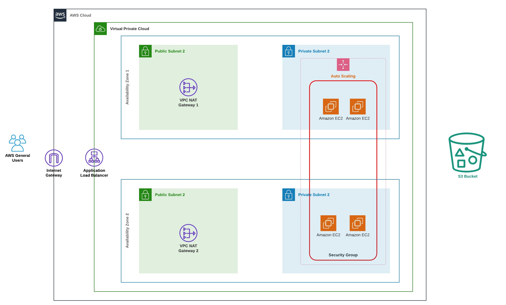
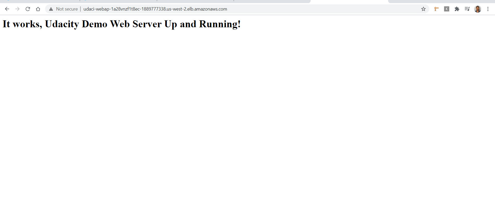

# Project 2 - Deploy a High Availability Web App using CloudFormation 



> In this project, I deployed web servers for a highly available web app using CloudFormation.

## Files included:
```sh
* Diagram-of-the-Udagram-App.jpeg : AWS infrastructure diagram
* Udacity-Udagram-App.jpg : Website's Screenshot
* create.sh : Cloudformation create stack script (mac)
* update.sh : Cloudformation update stack script (mac)
* destroy.sh : Cloudformation delete stack script (mac)
* create.bat : Cloudformation create stack script (win)
* update.bat : Cloudformation update stack script (win)
* destroy.bat : Cloudformation delete stack script (win)
* infrastructure.yml : Udagram Project's CloudFormation script
* parameters.json : Udagram Project's CloudFormation script parameters
```
## Commands:

### MAC
1. Create Stack
```sh
> ./create.sh UdagramApp infrastructure.yml parameters.json
```
2. Delete Stack
```sh
> ./destroy.sh UdagramApp infrastructure.yml parameters.json
```

### Windows
1. Create Stack
```sh
> ./create.bat UdagramApp infrastructure.yml parameters.json
```
2. Delete Stack
```sh
> ./destroy.bat UdagramApp infrastructure.yml parameters.json
```

## Website:
